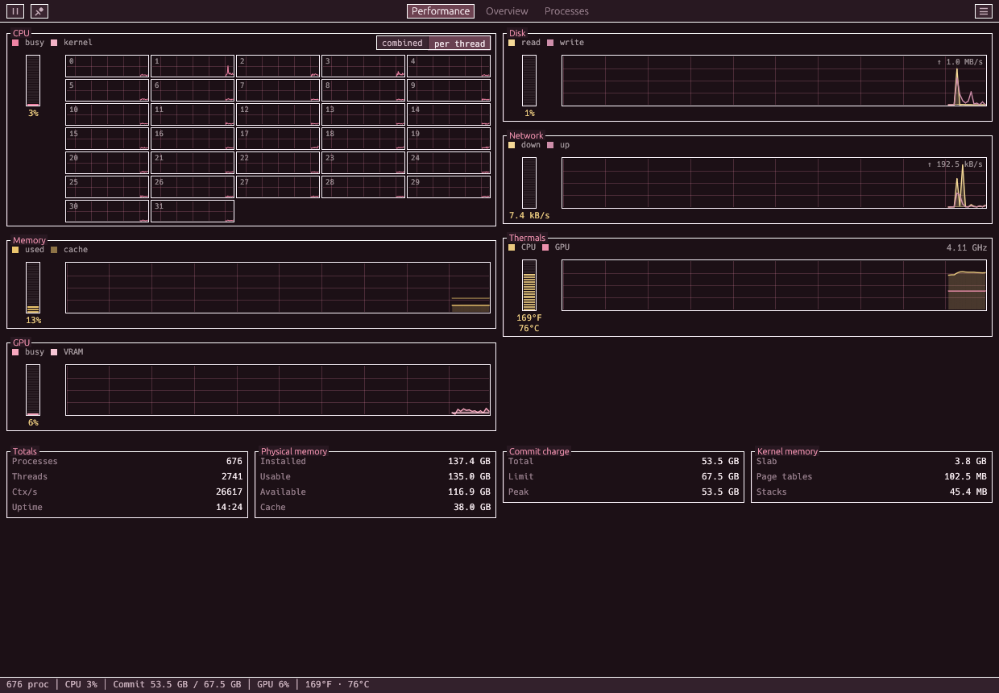
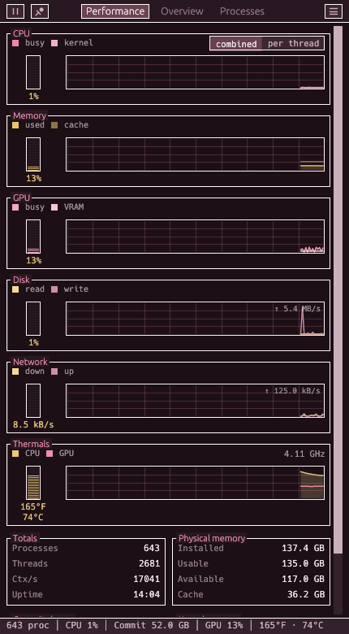
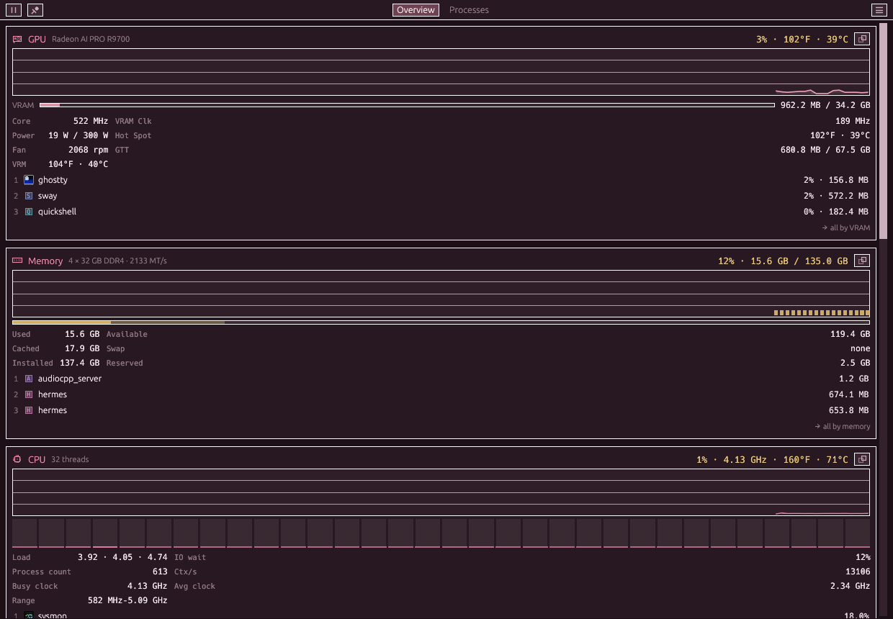
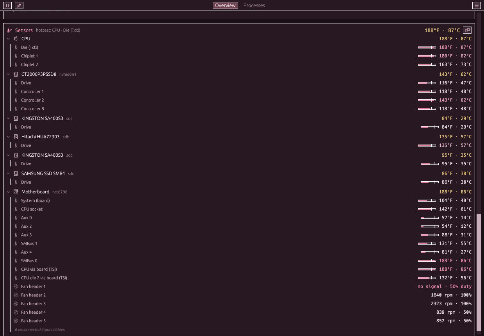

# SysMon

A compact system monitor for AMD-GPU Linux desktops — and a system
state API you can script against. One Rust binary: the window, the
engine, the CLI, the socket.

Every number it shows is checked against the tool a skeptic would open
beside it (`free`, `turbostat`, `mpstat`, `sensors`, `iostat`, `pidstat`,
`df`, firmware tables) on real hardware, idle, under load and under a
known disk writer: **64 of 64 agree.**



Every number the window shows is one command away:

```bash
sysmon probe network --json | jq .result.network.top_processes
```

## v1 → v3, honestly

v2 was a ground-up rewrite and v3 is that engine grown up. The
Python/GTK3 tree (tag `v1.0.0`) is gone; same information priority,
new engine.

| | v1 (Python/GTK3) | v3 (Rust/egui) |
|---|---|---|
| engine | psutil + nethogs | own /proc·/sys collectors, netlink sock_diag, optional nethogs merge |
| per-process network | nethogs only (or nothing) | native TCP attribution with zero setup; nethogs upgrades it to UDP/QUIC + all users |
| programmatic access | none | `probe` / `tap` / `ctl` / `schema` + control socket, JSON envelopes, a strict machine contract, and a conformance harness that re-runs the whole standard |
| idle CPU (same display, 60 s, software rendering) | 13.0% of a core | **6.0%** — and `serve` idles at **0.00% / 5.6 MB** |
| accuracy | trusted psutil | a 64-check live audit against free/turbostat/mpstat/sensors/iostat/pidstat/df/DMI, plus cross-checks in `cargo test` |
| theming | adopts the GTK theme | eleven built-in palettes (including a greyscale a11y floor) + a System mode that maps your GTK theme to the nearest family, and honors high-contrast and reduced-motion |
| process icons | icon theme lookup, gaps common | desktop-entry index over the real icon-theme inherit chain, letter-tile fallback |

**Not carried over / changed, said out loud:**
- v1 literally *wore* your GTK theme; v3 draws its own chrome. System
  mode reads your Cinnamon/GNOME theme name and picks the closest
  family (Blossom → Blossom Dark, `*-Dark*` → Dark, else Light).
- Funky Pink kept its colors and lost its wonky corners — everything
  is sharp-cornered now, by design.
- Drag-a-pop-out-back-to-dock needs X11 (button state); on Wayland
  use the ⧉ toggle or close the pop-out. Everything else is
  display-server-agnostic.
- NVIDIA/Intel GPUs: still an honest "no AMD GPU" card, like v1.
- v3 changed the wire in one way worth knowing: `ts` is now ISO-8601
  with a UTC offset rather than a float (the epoch rides along as
  `ts_epoch`), error envelopes carry an `exit` code, and every NDJSON
  stream line carries `event`. Everything v2 emitted, v3 still emits.

Your v1 `settings.json` is read and migrated in place — including the
detail that v1's "Blossom" *was* the AMOLED look, so that's what it
becomes.

## What it shows

### Performance (the front page)

The Windows XP Task Manager's Performance tab, in SysMon's own hand:
an LED meter beside a scrolling scope graph for each resource, etched
boxes of totals underneath, a status bar along the bottom. Everything
on one screen, no scrolling to find a number, and the window opens
here.



| Row | Meter | Graph |
|---|---|---|
| **CPU** | busy % | busy % with **kernel time** (system + irq + softirq) as a second trace, or **one small graph per thread** in `/proc/stat` order. A carved two-way switch picks; *auto* chooses by width |
| **Memory** | used % | used, with cache beneath it |
| **GPU** | busy % | busy, with VRAM as a second trace |
| **Disk** | busiest drive's util % | read and write, autoscaled with the ceiling written in the corner (a spike never hides what follows) |
| **Network** | share of the fastest link | down and up, same |
| **Thermals** | CPU °F · °C | CPU and GPU temperature over time, the busy clock beside it. No warnings: the heat is shown next to the clock it costs, and the data speaks |

Under the rows: **Totals** (processes, threads, ctx/s, uptime),
**Physical memory** (installed, usable, available, cache), **Commit
charge** (`Committed_AS`, `CommitLimit`, and SysMon's own peak since
launch, labelled as such) and **Kernel memory** (slab, page tables,
stacks). Every graph sits on a dark instrument field, tinted to the
theme, with a graticule that moves one step per sample. Clicking a
meter opens that card on the Overview; clicking a graph opens
Processes sorted by that resource.

The three new numbers (kernel time, commit charge, kernel memory) are
audited like everything else: C7 against `mpstat`, M7/M8 against
`/proc/meminfo`.

### Overview



| Card | Readings |
|---|---|
| **GPU** | busy %, VRAM bar, core/VRAM clocks (averaged across the window, not one lucky read), power vs cap, edge + hot-spot + **VRM** temps, fan, **GTT**, top-3 GPU processes — amdgpu sysfs, `gpu_metrics` + DRM fdinfo |
| **Memory** | used / available / cached as a share bar, swap, and the three totals told apart: **installed** (your sticks, from firmware), **usable** (what the kernel gets), **reserved** (the difference). The subtitle names the sticks and the speed they actually run at. Top-3 by RSS |
| **CPU** | overall + per-core bars, the **busy clock** (what the working cores actually delivered, the number turbostat calls Bzy_MHz), package temp, load, **IO wait** (kept out of busy %), ctx/s, top-3 by CPU |
| **Network** | live ↓/↑ (physical interfaces), totals, **per-interface rows with IPs and link speed**, top-3 by traffic with **↓/↑ split**, source disclosure |
| **Disks** | every real mounted drive: label, R/W rates, **util %**, usage bar |
| **Sensors** | grouped by what they measure: CPU, each drive by model, motherboard. Plain names (*Die (Tctl)*, *Chiplet 1*, *Fan header 2*), a heat bar against each sensor's own limit, fans with drive % beside rpm (a fan driven at 50% that reads 0 rpm stands out), unconnected inputs folded away, battery when present |

Temperatures read in **°F, °C, or both at once** ("131°F · 55°C"), and
sizes in decimal GB by default (binary is one click away). Both live in
the ☰ menu.

Any card pops out into its own always-pinned window (⧉) — it keeps
updating with the main window minimized, and **dropping it onto the
main window docks it back**. Pop-outs are remembered across launches.



### Processes, and the Inspector

The Processes page: icon, name, PID, user, CPU %, memory, GPU %,
VRAM, disk R/W, **net ↓/↑**, threads, priority, state, age, command —
every column sortable (persisted), horizontally scrollable when the
window runs narrow, filterable (Ctrl+F), with end/kill/renice
(pkexec ladder for the privileged cases). **Group by app** folds a
browser's forty renderers into one row.

Click any process (here, or in a card's top-3 on the Overview) and the
**Inspector** opens beside the table: where it came from (the parent
chain, each step clickable), live CPU and memory, its memory told
honestly (resident vs fair share vs what quitting it would actually
free), open files, OOM score, cgroup, working directory, children to
drill into, and its sockets. The strip above the table links each
figure back to its Overview card. A right-click menu always acts on the
process you right-clicked, even if the list re-sorts while it's open.

Ctrl+click selects up to five processes for a **combined details**
view — summed usage with color-coded share bars.


Shortcuts: `Ctrl+1` Performance, `Ctrl+2` Overview, `Ctrl+3`
Processes, `Ctrl+F` the filter, `P` pin.

## The API

```bash
sysmon probe [section]      # one-shot JSON (works with nothing running)
sysmon tap network -i 2     # NDJSON stream — the desktop-bar diet
sysmon ctl shot /tmp/s.png  # drive the window: pages, themes, pop-outs, screenshots
sysmon serve                # headless daemon; idle = literally zero sampling
sysmon schema               # the machine-readable map of everything
```

One envelope per reply, errors always carry a `fix`, exit codes
0/2/3/4, JSON automatic when piped. The full contract with examples:
[docs/API.md](docs/API.md), `man sysmon`, `sysmon schema`.

Degraded modes are disclosed, never silent: if the window has to
render without GPU acceleration (no usable Vulkan driver), it says
so at startup and `ctl status` carries `renderer_hint` with the fix
— a monitor is never allowed to be mysteriously slow.

### Per-process network without root

The engine asks netlink `sock_diag` for every TCP socket's kernel
byte counters (the numbers `ss -ti` shows) and resolves socket
inodes to pids — real per-process rates, no packet capture, no
setup. If [nethogs](https://github.com/raboof/nethogs) is installed
with capture caps, it takes over as the source: packet truth,
UDP/QUIC, other users' processes:

```bash
sudo apt install nethogs
sudo setcap 'cap_net_admin,cap_net_raw+ep' $(which nethogs)
```

The UI and the API always disclose which source fed them.

## Accuracy

Two layers, both on real hardware:

- `scripts/accuracy-audit.sh` puts every number the app shows next to
  the tool a human would check it with (`free`, `turbostat`, `mpstat`,
  `sensors -j`, `lspci`, `df`, `findmnt`, `ps`, firmware DIMM tables),
  once idle and once under `stress-ng` load, and writes a report.
- `cargo test` cross-checks each reading against an independent read
  of the same source, with the tolerance and its reason stated.

The ways each number could mislead are written down first
([FAILURE-MODES.md](docs/dev/FAILURE-MODES.md)); each fix starts as a
failing test. A failing check is a collector bug, and tolerances never
widen to pass. Every definition and its authority:
[docs/dev/ACCURACY.md](docs/dev/ACCURACY.md).

## Install

Packages and checksums on the
[releases page](https://github.com/RamenFast/sysmon/releases).

```bash
# Debian / Ubuntu / Mint
sudo apt install ./sysmon_3.1.0_amd64.deb

# Fedora / RHEL (built on Mint, rpm --test verified — reports welcome)
sudo dnf install ./sysmon-3.1.0-1.x86_64.rpm

# from source
sudo apt install build-essential curl git            # apt
sudo dnf install gcc make curl git                   # dnf
curl --proto '=https' --tlsv1.2 -sSf https://sh.rustup.rs | sh
git clone https://github.com/RamenFast/sysmon && cd sysmon
cargo build --release && sudo install -m755 target/release/sysmon /usr/local/bin/
```

Verify: `sysmon --version` → `sysmon 3.1.0 (v3)`.

Runs everywhere a Linux desktop runs; the GPU card wants an amdgpu
card, everything else degrades gracefully. Motherboard fan and voltage
sensors need your board's Super-I/O driver loaded (on most AMD boards,
`sudo modprobe nct6775`); drive temperatures need `drivetemp`.

## Gallery

Eleven palettes, all first-class — switching themes changes the room,
not just the paint. Blossom Dark is the default; System mode follows
your GTK theme's family, and hands you Greyscale when your desktop
asks for high contrast.

| | |
|---|---|
|  *Blossom AMOLED — v1's true-black look* |  *Blossom — petal on paper* |
|  *Light* |  *Dark* |
|  *Paper — warm reading light* |  *Basalt — bevel city* |
|  *Amber CRT* |  *Chromacore — the 1905 terminal* |
|  *Funky Pink* |  *Greyscale — the a11y floor, WCAG AAA* |
|  *Compact mode* | |


*A popped-out GPU card living its own life.*

## Layout & docs

```
crates/sysmon-core   the engine: collectors, snapshot model (the wire
                     contract), desktop-entry/icon index, accuracy suite
crates/sysmon-app    the binary: GUI (eframe/egui), CLI verbs, control
                     socket, kittest UI tests
scripts/e2e.sh       the live receipt run (Xvfb: screenshots, drag-dock,
                     single-instance, contract checks; then native Wayland)
scripts/accuracy-audit.sh  every shown number vs free/turbostat/sensors/…
packaging/           deb + rpm builds, manpage, desktop entry
```

Working on it (human or agent)? The docs assume zero context:

- [CLAUDE.md](CLAUDE.md) — laws, commands, gotchas (auto-loaded by Claude Code)
- [docs/AGENTS.md](docs/AGENTS.md) — driving the app/API as an agent
- [docs/ARCHITECTURE.md](docs/ARCHITECTURE.md) — the developer map: crates, data flow, threading
- [docs/dev/EXTENDING.md](docs/dev/EXTENDING.md) — checklists: add a collector/card/verb/palette/column
- [docs/dev/TESTING.md](docs/dev/TESTING.md) — the five test layers + the Xvfb gotchas
- [docs/dev/ACCURACY.md](docs/dev/ACCURACY.md) — every number's authority and tolerance
- [docs/dev/FAILURE-MODES.md](docs/dev/FAILURE-MODES.md) — how each number could lie, and what catches it
- [HANDOFF.md](HANDOFF.md) — project state and the next-session ledger

## License & credits

GPL-3.0-or-later — see [LICENSE](LICENSE).

Built by Ben with [Claude Code](https://claude.com/claude-code)
(Claude Fable 5) — engine, chrome, tests, and the accuracy suite in
one very long, very pink session. The 3.1 accuracy round (the live
audit, the Inspector, the sensors rework, the glyphs) was built in
[Jcode](https://github.com/1jehuang/jcode) with Claude Opus 5.5, with
two read-only Opus 5.5 workers auditing and reviewing.
