# SysMon

A compact system monitor for AMD-GPU Linux desktops — and a system
state API you can script against. One Rust binary: the window, the
engine, the CLI, the socket.

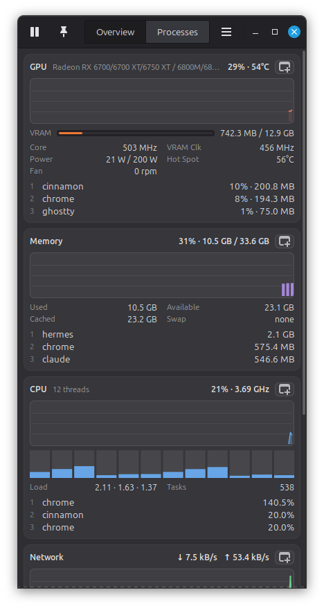

Every number the window shows is one command away:

```bash
sysmon probe network --json | jq .result.network.top_processes
```

## v1 → v3, honestly

v2 was a ground-up rewrite and v3 is that engine grown up. The
Python/GTK3 tree (tag `v1.0.0`) is gone; same information priority,
new engine.

| | v1 (Python/GTK3) | v3 (Rust/egui) |
|---|---|---|
| engine | psutil + nethogs | own /proc·/sys collectors, netlink sock_diag, optional nethogs merge |
| per-process network | nethogs only (or nothing) | native TCP attribution with zero setup; nethogs upgrades it to UDP/QUIC + all users |
| programmatic access | none | `probe` / `tap` / `ctl` / `schema` + control socket, JSON envelopes, a strict machine contract, and a conformance harness that re-runs the whole standard |
| idle CPU (same display, 60 s, software rendering) | 13.0% of a core | **6.0%** — and `serve` idles at **0.00% / 5.6 MB** |
| accuracy | trusted psutil | cross-checked live against free/df/ps//proc/sysfs in `cargo test` |
| theming | adopts the GTK theme | eleven built-in palettes (including a greyscale a11y floor) + a System mode that maps your GTK theme to the nearest family, and honors high-contrast and reduced-motion |
| process icons | icon theme lookup, gaps common | desktop-entry index over the real icon-theme inherit chain, letter-tile fallback |

**Not carried over / changed, said out loud:**
- v1 literally *wore* your GTK theme; v3 draws its own chrome. System
  mode reads your Cinnamon/GNOME theme name and picks the closest
  family (Blossom → Blossom Dark, `*-Dark*` → Dark, else Light).
- Funky Pink kept its colors and lost its wonky corners — everything
  is sharp-cornered now, by design.
- Drag-a-pop-out-back-to-dock needs X11 (button state); on Wayland
  use the ⧉ toggle or close the pop-out. Everything else is
  display-server-agnostic.
- NVIDIA/Intel GPUs: still an honest "no AMD GPU" card, like v1.
- v3 changed the wire in one way worth knowing: `ts` is now ISO-8601
  with a UTC offset rather than a float (the epoch rides along as
  `ts_epoch`), error envelopes carry an `exit` code, and every NDJSON
  stream line carries `event`. Everything v2 emitted, v3 still emits.

Your v1 `settings.json` is read and migrated in place — including the
detail that v1's "Blossom" *was* the AMOLED look, so that's what it
becomes.

## What it shows

| Card | Readings |
|---|---|
| **GPU** | busy %, VRAM bar, core/VRAM clocks, power vs cap, edge + hot-spot temps, fan, **GTT**, top-3 GPU processes — amdgpu sysfs + DRM fdinfo, the sources nvtop reads |
| **Memory** | used (= total − available), available, cached, **buffers, dirty**, swap, top-3 by RSS |
| **CPU** | overall + per-core bars, frequency + **range**, package temp, load, tasks, **ctx/s**, top-3 by CPU |
| **Network** | live ↓/↑ (physical interfaces), totals, **per-interface rows with IPs and link speed**, top-3 by traffic with **↓/↑ split**, source disclosure |
| **Disks** | every real mounted drive: label, R/W rates, **util %**, usage bar |
| **Sensors** | every hwmon chip, gaps and all (CPU Tctl *and* Tccd dies), **drive temps with the drive named** (`sda · KINGSTON…`, via drivetemp/nvme), fans with rated max, **voltage rails, power draw vs cap**, battery when present |

Any card pops out into its own always-pinned window (⧉) — it keeps
updating with the main window minimized, and **dropping it onto the
main window docks it back**. Pop-outs are remembered across launches.

The Processes page: icon, name, PID, user, CPU %, memory, GPU %,
VRAM, disk R/W, **net ↓/↑**, threads, priority, state, age, command —
every column sortable (persisted), horizontally scrollable when the
window runs narrow, filterable (Ctrl+F), with end/kill/renice
(pkexec ladder for the privileged cases) and a per-process **details
window with the live connection list**. Ctrl+click selects up to
five processes for a **combined details** view — summed usage with
color-coded share bars — and right-clicking a process anywhere
offers *Open in process viewer*.

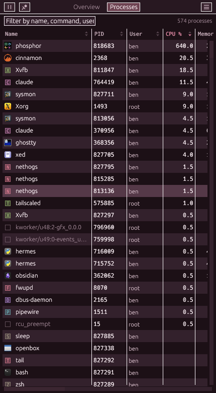

## The API

```bash
sysmon probe [section]      # one-shot JSON (works with nothing running)
sysmon tap network -i 2     # NDJSON stream — the desktop-bar diet
sysmon ctl shot /tmp/s.png  # drive the window: pages, themes, pop-outs, screenshots
sysmon serve                # headless daemon; idle = literally zero sampling
sysmon schema               # the machine-readable map of everything
```

One envelope per reply, errors always carry a `fix`, exit codes
0/2/3/4, JSON automatic when piped. The full contract with examples:
[docs/API.md](docs/API.md), `man sysmon`, `sysmon schema`.

Degraded modes are disclosed, never silent: if the window has to
render without GPU acceleration (no usable Vulkan driver), it says
so at startup and `ctl status` carries `renderer_hint` with the fix
— a monitor is never allowed to be mysteriously slow.

### Per-process network without root

The engine asks netlink `sock_diag` for every TCP socket's kernel
byte counters (the numbers `ss -ti` shows) and resolves socket
inodes to pids — real per-process rates, no packet capture, no
setup. If [nethogs](https://github.com/raboof/nethogs) is installed
with capture caps, it takes over as the source: packet truth,
UDP/QUIC, other users' processes:

```bash
sudo apt install nethogs
sudo setcap 'cap_net_admin,cap_net_raw+ep' $(which nethogs)
```

The UI and the API always disclose which source fed them.

## Accuracy

Every reading is cross-checked live against an independent authority
— `free -b`, `df -B1`, `ps`, direct /proc and /sys re-reads — in
`cargo test`, with justified tolerances (documented identity choices
in [docs/dev/ACCURACY.md](docs/dev/ACCURACY.md)). A failing check is
a collector bug; tolerances never widen to pass.

## Install

Packages and checksums on the
[releases page](https://github.com/RamenFast/sysmon/releases).

```bash
# Debian / Ubuntu / Mint
sudo apt install ./sysmon_3.0.2_amd64.deb

# Fedora / RHEL (built on Mint, rpm --test verified — reports welcome)
sudo dnf install ./sysmon-3.0.2-1.x86_64.rpm

# from source
sudo apt install build-essential curl git            # apt
sudo dnf install gcc make curl git                   # dnf
curl --proto '=https' --tlsv1.2 -sSf https://sh.rustup.rs | sh
git clone https://github.com/RamenFast/sysmon && cd sysmon
cargo build --release && sudo install -m755 target/release/sysmon /usr/local/bin/
```

Verify: `sysmon --version` → `sysmon 3.0.2 (v3)`.

Runs everywhere a Linux desktop runs; the GPU card wants an amdgpu
card, everything else degrades gracefully.

## Gallery

Eleven palettes, all first-class — switching themes changes the room,
not just the paint. Blossom Dark is the default; System mode follows
your GTK theme's family, and hands you Greyscale when your desktop
asks for high contrast.

| | |
|---|---|
| 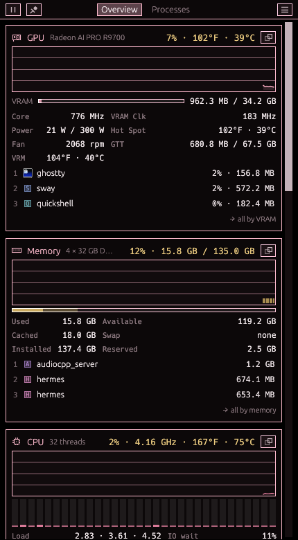 *Blossom AMOLED — v1's true-black look* | 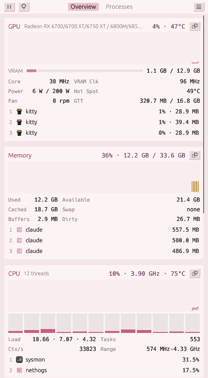 *Blossom — petal on paper* |
| 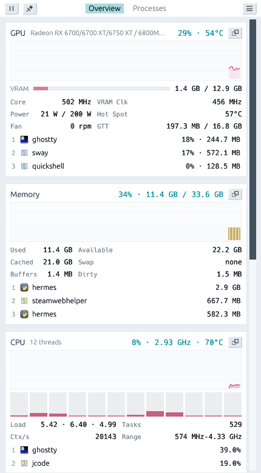 *Light* | 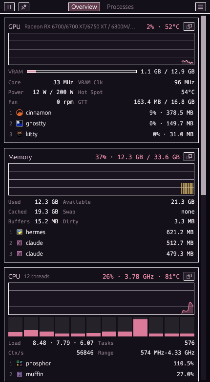 *Dark* |
| 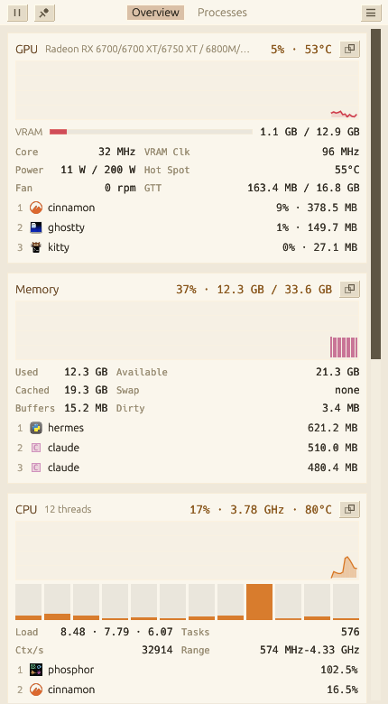 *Paper — warm reading light* | 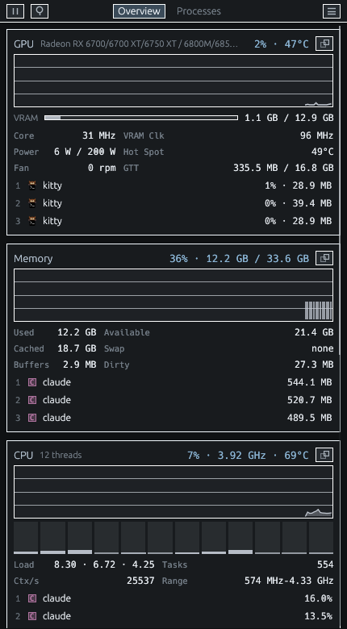 *Basalt — bevel city* |
| 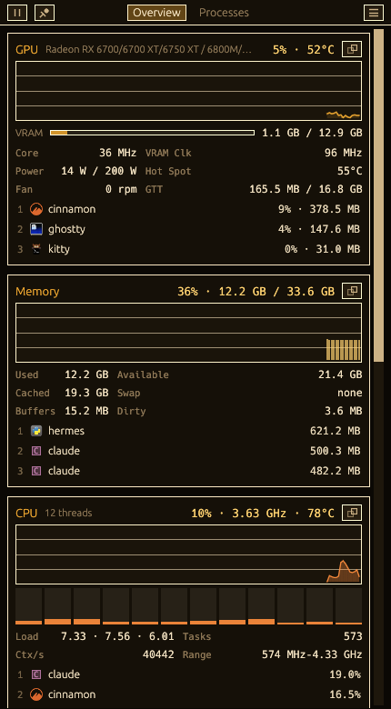 *Amber CRT* | 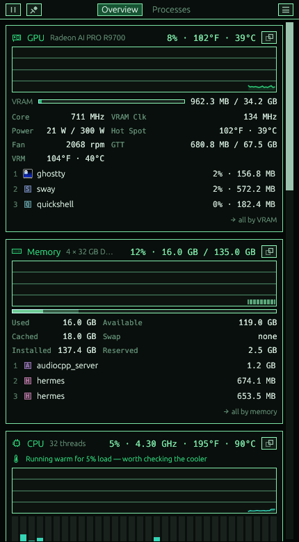 *Chromacore — the 1905 terminal* |
| 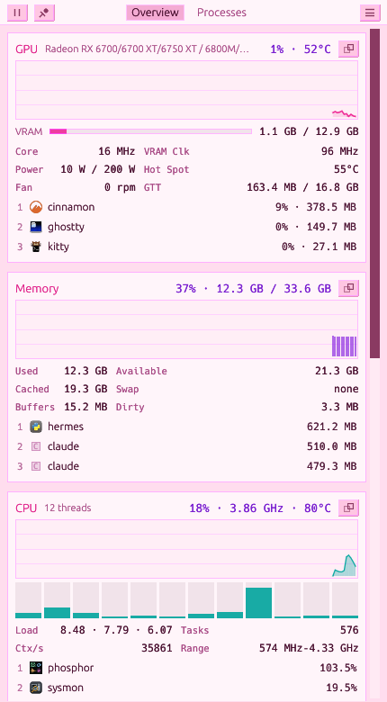 *Funky Pink* | 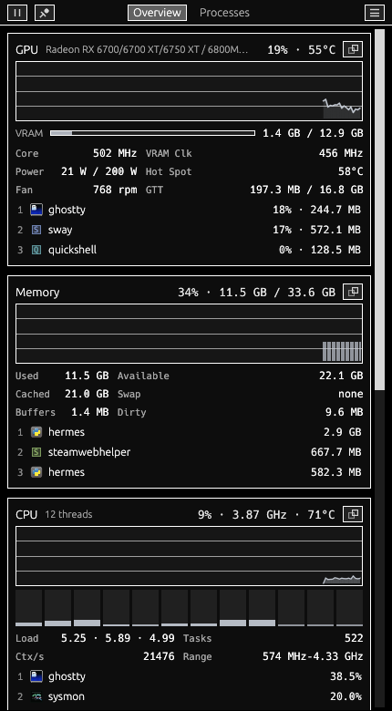 *Greyscale — the a11y floor, WCAG AAA* |
| 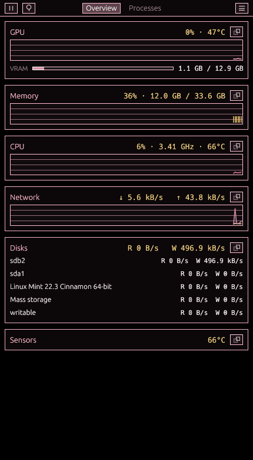 *Compact mode* | |

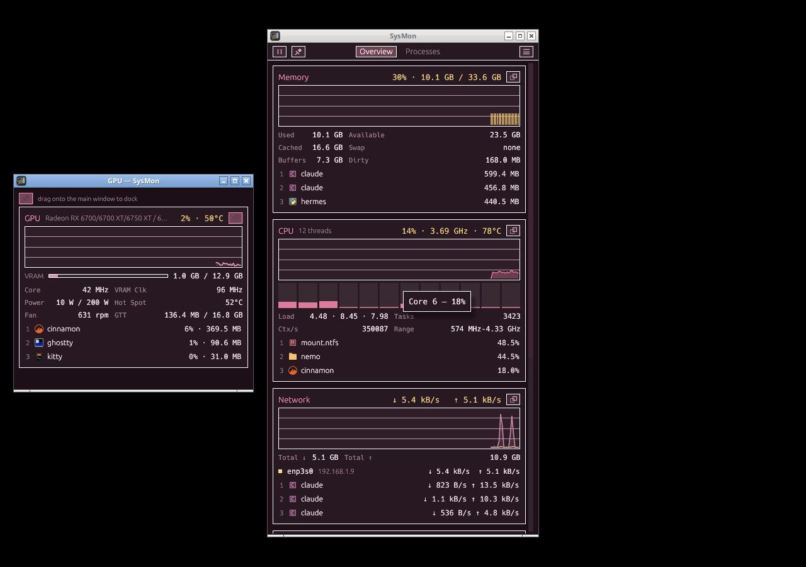
*A popped-out GPU card living its own life.*

## Layout & docs

```
crates/sysmon-core   the engine: collectors, snapshot model (the wire
                     contract), desktop-entry/icon index, accuracy suite
crates/sysmon-app    the binary: GUI (eframe/egui), CLI verbs, control
                     socket, kittest UI tests
scripts/e2e.sh       the live receipt run (Xvfb: screenshots, drag-dock,
                     single-instance, contract checks)
packaging/           deb + rpm builds, manpage, desktop entry
```

Working on it (human or agent)? The docs assume zero context:

- [CLAUDE.md](CLAUDE.md) — laws, commands, gotchas (auto-loaded by Claude Code)
- [docs/AGENTS.md](docs/AGENTS.md) — driving the app/API as an agent
- [docs/ARCHITECTURE.md](docs/ARCHITECTURE.md) — the developer map: crates, data flow, threading
- [docs/dev/EXTENDING.md](docs/dev/EXTENDING.md) — checklists: add a collector/card/verb/palette/column
- [docs/dev/TESTING.md](docs/dev/TESTING.md) — the five test layers + the Xvfb gotchas
- [docs/dev/ACCURACY.md](docs/dev/ACCURACY.md) — every number's authority and tolerance
- [HANDOFF.md](HANDOFF.md) — project state and the next-session ledger

## License & credits

GPL-3.0-or-later — see [LICENSE](LICENSE).

Built by Ben with [Claude Code](https://claude.com/claude-code)
(Claude Fable 5) — engine, chrome, tests, and the accuracy suite in
one very long, very pink session.
